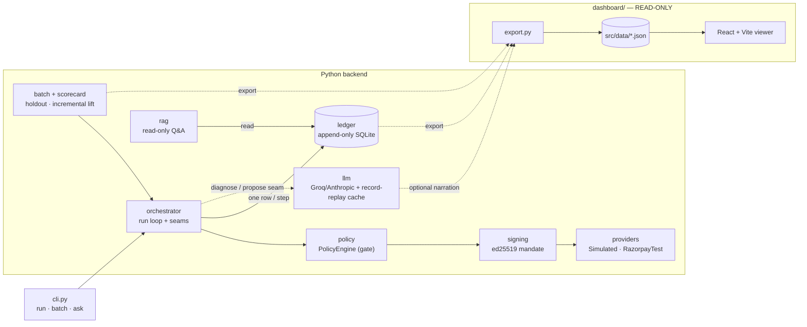
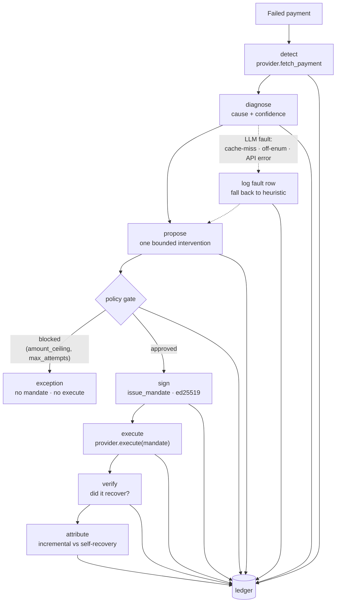
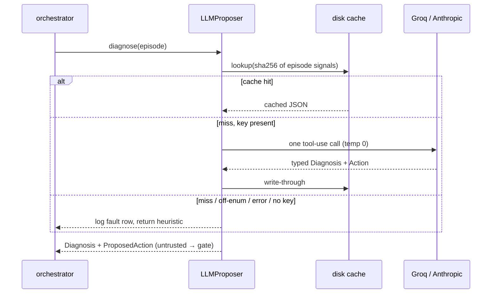
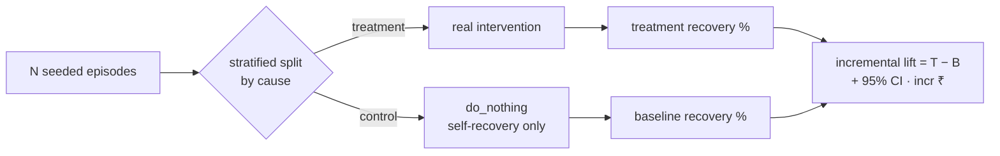
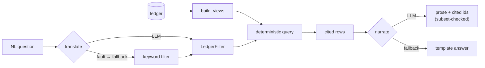

# Recovery OS

A **bounded, self-auditing agent** that handles failed payments end to end —
Razorpay buildathon, Track 3 (AI Revenue Recovery).

An LLM can *propose* what to do about a failed payment, but a deterministic
policy gate *disposes*: nothing moves money until it passes a non-LLM rule check
and is cryptographically signed. Every step is written to an append-only,
tamper-evident ledger, and results are measured as **incremental** recovery over
a holdout — not the flattering raw number.

```
detect → diagnose → propose → policy gate → sign → execute → verify → attribute
```

---

## The one guarantee

> **The LLM proposes. The deterministic engine disposes.**

It is enforced by the type system, not by convention: `PaymentProvider.execute`
accepts only a `SignedMandate`, and the only way to obtain one is
`signing.issue_mandate`, which raises `PolicyViolation` on a blocked decision.
There is **no code path** from a raw `ProposedAction` to `execute`. A malformed
or malicious LLM output is just untrusted input to the same gate.

---

## Architecture



**Reading it:** the CLI (or the batch runner) drives `orchestrator.run_episode`.
The loop asks the seam for a diagnosis + proposal (heuristic by default, LLM when
selected), routes it through the gate, signs it, executes via the active
provider, and appends one immutable row per step to the ledger. `batch` runs the
same loop over many episodes; `scorecard` measures them; `rag` answers questions
by *reading* the ledger. The dashboard renders exported JSON and touches none of
this.

---

## The recovery loop (workflow)



Failure is handled, not hidden: a bad LLM response logs a `fault` row and the run
continues on the heuristic — it never crashes a batch or skips the gate. A
gate-blocked action stops before any mandate exists.

Interventions are a fixed enum (`smart_retry`, `method_switch`, `mandate_reauth`,
`customer_nudge`, `human_escalation`, `do_nothing`); causes likewise
(`issuer_downtime`, `insufficient_funds`, `expired_instrument`, `network_error`,
`abandonment`, `mandate_failure`).

---

## The LLM proposer — reproducible & safe

The LLM plugs into the `diagnose`/`propose` seam and **only** there. One
structured tool-use call per episode, temperature 0, wrapped in a disk
record-replay cache so runs are deterministic and free after the first pass.



Backends are picked from the environment: **Groq** first (free tier,
`openai/gpt-oss-120b`, `temperature=0`), then **Anthropic**
(`claude-opus-5`), else fully offline (cache/fixtures only). Set a key via
`export GROQ_API_KEY=...` or a line in `.env`; override the model with
`RECOVERY_OS_LLM_MODEL=<id>`.

---

## Measurement — incremental, not raw

`batch.py` runs the unchanged loop over a **seeded, stratified** treatment/control
holdout. `scorecard.py` reports **incremental lift** (treatment recovery − control
self-recovery), with 95% confidence intervals, false-effort cost, and
gate-blocked episodes excluded from the lift denominator. Raw recovery is shown
but explicitly labeled secondary. Self-recovery rates are tunable, cited
assumptions in `config.py`.



Four policies run the same batch for comparison: `agent` (cause-aware),
`immediate` (retry-always), `fixed_schedule` (dunning), `never` (pure
self-recovery baseline).

---

## Ask — RAG Q&A over the ledger (read-only)

Retrieval is **deterministic**: each episode is rebuilt into a typed
`EpisodeView` and filtered over real fields. The LLM is the language layer only —
it translates the question to a `LedgerFilter` and narrates the retrieved rows,
citing episode ids. No row → no claim; invented citations are dropped.



It never writes to the ledger and never changes a Phase 0–3 contract.

---

## Dashboard — a read-only audit console

`dashboard/` is a React + Vite + TypeScript viewer over three committed JSON
exports. **It contains no recovery logic, makes no live calls, and never mutates
anything** — it renders what the backend produced. Three views: the pipeline
trace (with the LLM fault visibly breaking the audit spine), the incremental
scorecard, and the saved Ask answers (toggle between the offline template
narrator and Groq over the *same* cited rows).

`export.py` is the only bridge — a read-only reshaper of a seeded ledger +
scorecard into `src/data/*.json`. It optionally uses a Groq key from `.env` to
add the second Ask narration; the trace/scorecard numbers are fixed by the seed.

---

## Install & run (backend)

```bash
python3 -m venv .venv
source .venv/bin/activate
pip install -e ".[dev]"
```

```bash
recovery-os run pay_ABC123                 # one episode (heuristic)
recovery-os run pay_ABC123 --proposer llm  # one episode (LLM, cache-first)
recovery-os batch --n 100 --seed 42 --compare        # agent vs 3 baselines
recovery-os batch --n 50  --seed 42 --db batch.db    # build a ledger to query
recovery-os ask "list every gate-blocked action and the rule that blocked it" --db batch.db
```

## Run the dashboard (offline)

```bash
cd dashboard && npm install     # once
npm run dev -- --open           # http://localhost:5173
```

Refresh the data it shows (with the dev server running, it hot-reloads):

```bash
python dashboard/export.py      # regenerates dashboard/src/data/*.json
```

## Test

```bash
pytest        # 37 tests, fully offline — no API key, no network
```

Covers the signing round-trip + tamper detection, append-only ledger, the gate
blocking an over-ceiling action, batch reproducibility + incremental math, the
LLM proposer (parse / fallback / gate-block) replayed from committed fixtures,
and the RAG query/translate/narrate paths.

## Config

Copy `.env.example` to `.env`. Modeling knobs (self-recovery rates, amount range,
dunning attempts) live in `recovery_os/config.py`, labeled as tunable
assumptions. Keys (`GROQ_API_KEY` / `ANTHROPIC_API_KEY`) are read from `.env` by
the CLI.

## Layout

```
recovery_os/  config · domain · signing · policy · providers · ledger ·
              orchestrator · batch · scorecard · llm · rag · cli · api
tests/        signing · ledger · policy · orchestrator · batch · llm · rag (+ fixtures)
dashboard/    read-only React viewer + export.py (src/data/*.json)
```

See [CLAUDE.md](CLAUDE.md) for the full invariants, and
[dashboard/README.md](dashboard/README.md) for the viewer.
