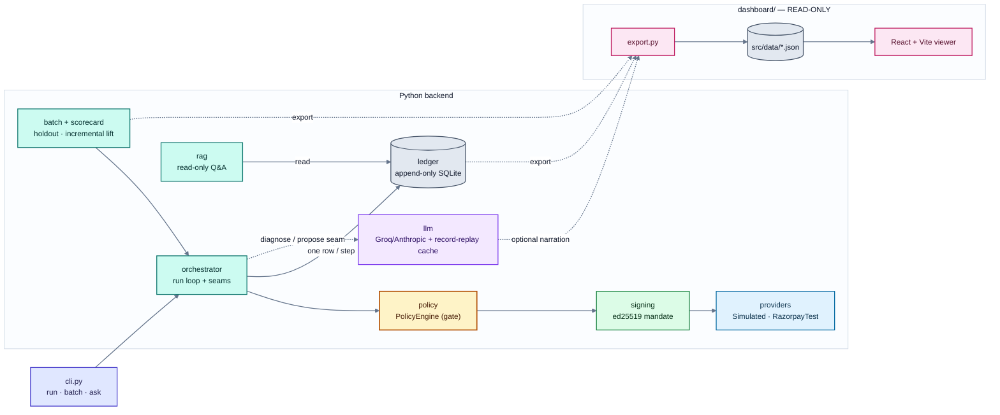
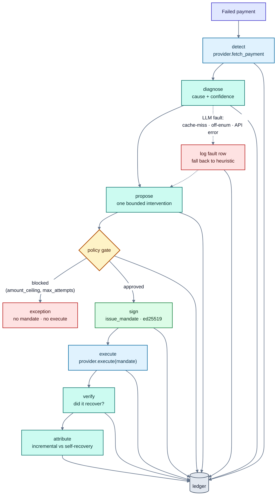
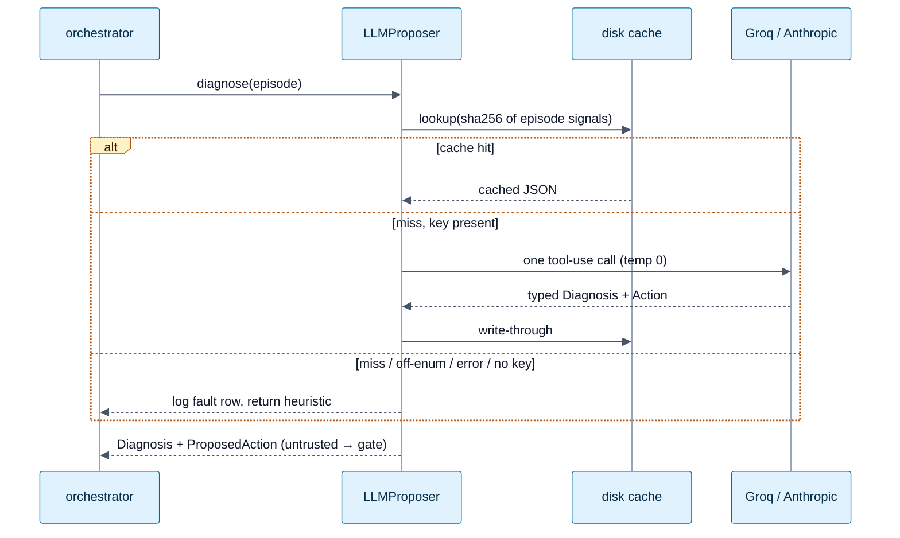
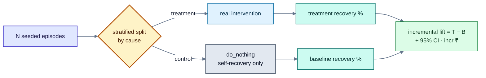

# Recovery OS

A **bounded, self-auditing agent** that handles failed payments end to end —
Razorpay buildathon, Track 3 (AI Revenue Recovery).

An LLM can *propose* what to do about a failed payment, but a deterministic
policy gate *disposes*: nothing moves money until it passes a non-LLM rule check
and is cryptographically signed. Every step is written to an append-only,
tamper-evident ledger, and results are measured as **incremental** recovery over
a holdout — not the flattering raw number.

```
detect → diagnose → propose → policy gate → sign → execute → verify → attribute
```

---

## The one guarantee

> **The LLM proposes. The deterministic engine disposes.**

It is enforced by the type system, not by convention: `PaymentProvider.execute`
accepts only a `SignedMandate`, and the only way to obtain one is
`signing.issue_mandate`, which raises `PolicyViolation` on a blocked decision.
There is **no code path** from a raw `ProposedAction` to `execute`. A malformed
or malicious LLM output is just untrusted input to the same gate.

---

## Architecture



**Reading it:** the CLI (or the batch runner) drives `orchestrator.run_episode`.
The loop asks the seam for a diagnosis + proposal (heuristic by default, LLM when
selected), routes it through the gate, signs it, executes via the active
provider, and appends one immutable row per step to the ledger. `batch` runs the
same loop over many episodes; `scorecard` measures them; `rag` answers questions
by *reading* the ledger. The dashboard renders exported JSON and touches none of
this.

---

## The recovery loop (workflow)



Failure is handled, not hidden: a bad LLM response logs a `fault` row and the run
continues on the heuristic — it never crashes a batch or skips the gate. A
gate-blocked action stops before any mandate exists.

Interventions are a fixed enum (`smart_retry`, `method_switch`, `mandate_reauth`,
`customer_nudge`, `human_escalation`, `do_nothing`); causes likewise
(`issuer_downtime`, `insufficient_funds`, `expired_instrument`, `network_error`,
`abandonment`, `mandate_failure`).

---

## The LLM proposer — reproducible & safe

The LLM plugs into the `diagnose`/`propose` seam and **only** there. One
structured tool-use call per episode, temperature 0, wrapped in a disk
record-replay cache so runs are deterministic and free after the first pass.



Backends are picked from the environment: **Groq** first (free tier,
`openai/gpt-oss-120b`, `temperature=0`), then **Anthropic**
(`claude-opus-5`), else fully offline (cache/fixtures only). Set a key via
`export GROQ_API_KEY=...` or a line in `.env`; override the model with
`RECOVERY_OS_LLM_MODEL=<id>`.

---

## Measurement — incremental, not raw

`batch.py` runs the unchanged loop over a **seeded, stratified** treatment/control
holdout. `scorecard.py` reports **incremental lift** (treatment recovery − control
self-recovery), with 95% confidence intervals, false-effort cost, and
gate-blocked episodes excluded from the lift denominator. Raw recovery is shown
but explicitly labeled secondary. Self-recovery rates are tunable, cited
assumptions in `config.py`.



Four policies run the same batch for comparison: `agent` (cause-aware),
`immediate` (retry-always), `fixed_schedule` (dunning), `never` (pure
self-recovery baseline).

---

## Ask — RAG Q&A over the ledger (read-only)

Retrieval is **deterministic**: each episode is rebuilt into a typed
`EpisodeView` and filtered over real fields. The LLM is the language layer only —
it translates the question to a `LedgerFilter` and narrates the retrieved rows,
citing episode ids. No row → no claim; invented citations are dropped.

```mermaid
%%{init: {'theme':'base','themeVariables':{'background':'#ffffff','primaryColor':'#f8fafc','primaryTextColor':'#0f172a','primaryBorderColor':'#94a3b8','secondaryColor':'#f1f5f9','tertiaryColor':'#ffffff','lineColor':'#64748b','fontSize':'14px','clusterBkg':'#fbfdff','clusterBorder':'#cbd5e1','edgeLabelBackground':'#ffffff','nodeTextColor':'#0f172a','titleColor':'#0f172a'}}}%%
flowchart LR
  Q["NL question"] --> TR{translate}
  TR -->|LLM| FTR["LedgerFilter"]
  TR -->|"fault → fallback"| KW["keyword filter"] --> FTR
  LED[("ledger")] --> VW["build_views"] --> QRY["deterministic query"]
  FTR --> QRY --> ROWS["cited rows"]
  ROWS --> NAR{narrate}
  NAR -->|LLM| A1["prose + cited ids<br/>(subset-checked)"]
  NAR -->|fallback| A2["template answer"]

  classDef entry fill:#e0e7ff,stroke:#4338ca,stroke-width:1.5px,color:#1e1b4b
  classDef gate fill:#fef3c7,stroke:#b45309,stroke-width:2px,color:#451a03
  classDef sign fill:#dcfce7,stroke:#15803d,stroke-width:1.5px,color:#052e16
  classDef prov fill:#e0f2fe,stroke:#0369a1,stroke-width:1.5px,color:#082f49
  classDef llm fill:#f3e8ff,stroke:#7c3aed,stroke-width:1.5px,color:#2e1065
  classDef store fill:#e2e8f0,stroke:#475569,stroke-width:1.5px,color:#0f172a
  classDef bad fill:#fee2e2,stroke:#b91c1c,stroke-width:1.5px,color:#450a0a
  classDef calc fill:#ccfbf1,stroke:#0f766e,stroke-width:1.5px,color:#042f2e
  classDef view fill:#fce7f3,stroke:#be185d,stroke-width:1.5px,color:#500724

  class Q entry
  class TR,NAR gate
  class KW,A2 store
  class FTR,VW,QRY,ROWS calc
  class A1 llm
  class LED store

  linkStyle default stroke:#64748b,stroke-width:1.5px
```



It never writes to the ledger and never changes a Phase 0–3 contract.

---

## Dashboard — a read-only audit console

`dashboard/` is a React + Vite + TypeScript viewer over three committed JSON
exports. **It contains no recovery logic, makes no live calls, and never mutates
anything** — it renders what the backend produced. Three views: the pipeline
trace (with the LLM fault visibly breaking the audit spine), the incremental
scorecard, and the saved Ask answers (toggle between the offline template
narrator and Groq over the *same* cited rows).

`export.py` is the only bridge — a read-only reshaper of a seeded ledger +
scorecard into `src/data/*.json`. It optionally uses a Groq key from `.env` to
add the second Ask narration; the trace/scorecard numbers are fixed by the seed.

---

## Install & run (backend)

```bash
python3 -m venv .venv
source .venv/bin/activate
pip install -e ".[dev]"
```

```bash
recovery-os run pay_ABC123                 # one episode (heuristic)
recovery-os run pay_ABC123 --proposer llm  # one episode (LLM, cache-first)
recovery-os batch --n 100 --seed 42 --compare        # agent vs 3 baselines
recovery-os batch --n 50  --seed 42 --db batch.db    # build a ledger to query
recovery-os ask "list every gate-blocked action and the rule that blocked it" --db batch.db
```

## Live Razorpay test mode — the provider swap, proven

`SimulatedProvider` and `RazorpayTestProvider` sit behind the one
`PaymentProvider` Protocol, so swapping backends changes nothing above the seam:
same diagnosis, same policy gate, same signed mandate, same ledger trail.

```bash
recovery-os run demo1 --provider razorpay_test --amount 5000 \
  --trace demo/razorpay_live_trace.json
```

That makes **real calls against Razorpay test mode** — `POST /orders`,
`POST /payment_links`, `GET /payment_links/{id}`, `GET /payments/{id}` — and
writes the full 8-row ledger trail. Two captured runs are committed:
[razorpay_live_trace_success.json](demo/razorpay_live_trace_success.json) (a full
successful round trip) and
[razorpay_live_trace.json](demo/razorpay_live_trace.json) (the latest run). The
orders and links show up in the Razorpay test dashboard.

> **Test-mode cap:** Razorpay allows **30 payment links per business, for the life
> of a test account** — cancelling them does not reclaim any, and there is no
> delete API. So origination uses an **order** (uncapped) and a payment link is
> minted only *after* the gate approves an intervention that needs one. When the
> cap is hit, the link call 429s, gets logged as a `fault` row, and the run
> degrades to `executed=failed` — the pipeline still completes. Raising it needs
> a request to Razorpay Support, or a fresh test account.

That trace file is also what puts the live run on the audit console — `export.py`
reads it (never Razorpay directly, so export stays offline and deterministic) and
adds it as a fourth **live razorpay** episode beside the simulated ones:

```bash
recovery-os run demo1 --provider razorpay_test --trace demo/razorpay_live_trace.json
python dashboard/export.py     # picks the trace up; dashboard hot-reloads
```

**Real:** origination (`POST /orders`), the customer nudge (a payment link with
its `short_url` in the execution row — re-sent rather than re-minted if the
episode already has an open one), verification (`GET /orders/{id}` or the link,
then the payment's real `captured`/`authorized` status), and refunds
(`POST /payments/{id}/refund`).

**Still simulated:** failure *injection*. Test mode cannot summon issuer downtime
or an insufficient-funds decline on demand, and the Downtime API returns nothing
there — so the failure taxonomy and all batch measurement stay on
`SimulatedProvider`. That split is the design, not a gap. `smart_retry` and
`mandate_reauth` need a real saved instrument, so against test mode they log a
`fault` ledger row and return `failed` rather than pretending to have run.

The Groq/LLM proposer is orthogonal to all this. `--provider` chooses who *acts*;
`--proposer` chooses who *diagnoses*. `--provider razorpay_test` alone makes zero
LLM calls; add `--proposer llm` and Groq diagnoses a real Razorpay episode while
the gate, signing and ledger stay exactly the same.

**Production is a provider swap** — a third backend implementing the same three
methods. The gate, signing, ledger and scorecard never learn which one is active.

Keys come from `RAZORPAY_KEY_ID` / `RAZORPAY_KEY_SECRET` in the gitignored
`.env`. The provider refuses to construct without them, and refuses any key that
isn't `rzp_test_…` — a live key can never be reached from here. Every API error
is caught, logged as a `fault` row, and turned into a failed result; it never
crashes a run.

## Run the dashboard (offline)

```bash
cd dashboard && npm install     # once
npm run dev -- --open           # http://localhost:5173
```

Refresh the data it shows (with the dev server running, it hot-reloads):

```bash
python dashboard/export.py      # regenerates dashboard/src/data/*.json
```

## Test

```bash
pytest        # 37 tests, fully offline — no API key, no network
```

Three further tests (`tests/test_razorpay_live.py`) hit the real Razorpay test
API and **skip automatically** when `RAZORPAY_KEY_ID` / `RAZORPAY_KEY_SECRET` are
absent. Nothing in the offline suite touches the network or needs a key.

Covers the signing round-trip + tamper detection, append-only ledger, the gate
blocking an over-ceiling action, batch reproducibility + incremental math, the
LLM proposer (parse / fallback / gate-block) replayed from committed fixtures,
and the RAG query/translate/narrate paths.

## Config

Copy `.env.example` to `.env`. Modeling knobs (self-recovery rates, amount range,
dunning attempts) live in `recovery_os/config.py`, labeled as tunable
assumptions. Keys (`GROQ_API_KEY` / `ANTHROPIC_API_KEY`, and
`RAZORPAY_KEY_ID` / `RAZORPAY_KEY_SECRET` for the live backend) are read from
`.env` by the CLI. The live backend also wants a CA bundle — `pip install -e
".[razorpay]"` if your Python has none (python.org macOS builds ship without one).

## Layout

```
recovery_os/  config · domain · signing · policy · providers · ledger ·
              orchestrator · batch · scorecard · llm · rag · cli · api
tests/        signing · ledger · policy · orchestrator · batch · llm · rag ·
              razorpay_live (skipped without keys) (+ fixtures)
demo/         razorpay_live_trace*.json — real test-mode runs, captured
dashboard/    read-only React viewer + export.py (src/data/*.json)
```

The five invariants are stated in [The one guarantee](#the-one-guarantee) above;
see [dashboard/README.md](dashboard/README.md) for the viewer.

VIDEO LINK: https://drive.google.com/drive/folders/1vgmzuevcjg2cpWiMTiv7XhNSLxdPYHSP
